## Flutter Projects Portfolio

<h2 align='center'>About this Portfolio</h2>

  This repository showcases a collection of Flutter projects I've developed as a mobile application developer. Each project demonstrates different aspects of my technical expertise, problem-solving abilities, and UI/UX design skills across various domains and industries.

 
<h2 align='center'>Table of Contents</h2>

<ul>
  <li><a href="#green-eats">Green Eats - Grocery App</a></li>
  <li><a href="#roame">Roame - Tour Planning App</a></li>
  <li><a href="#my-nust">My NUST - University App</a></li>
  <li><a href="#wdyt">WDYT - Opinion Sharing App</a></li>
  <li><a href="#mindful-life">Mindful Life - AI Chatbot App</a></li>
  <li><a href="#movilar">Movilar - Movie App</a></li>
  <li><a href="#water-flow">Water Flow - Water Level Monitoring App</a></li>
  <li><a href="#ybs">Your Bridge School - Learning App</a></li>
  <li><a href="#ez-build">Ez Build - Online Buying and Selling App</a></li>
  <li><a href="#battlegrands">Battlegrands - Tournaments App</a></li>
  <li><a href="#dog-alert">Dog Alert - Dog Tracking App</a></li>
  <li><a href="#sleep">Sleep - Sound Therapy App</a></li>
</ul>

  
<h2 align='center' id="green-eats">Green Eats</h2>

Developed 'Green Eats', a full-stack grocery app with admin panel, available on multiple platforms including Play Store, App Store, and Website. Used Flutter for the front-end and Firebase for database, authentication, hosting, notification service, cloud functions and other cloud features.

<h3>Tech Stack</h3>
<ul>
  <li><strong>Frontend:</strong> Flutter, Dart, Provider State Management</li>
  <li><strong>Backend:</strong> Firebase Firestore, Firebase Auth, Firebase Functions</li>
  <li><strong>Features:</strong> Real-time inventory updates, Payment processing, Order tracking, Admin dashboard</li>
  <li><strong>Platforms:</strong> iOS, Android, Web</li>
</ul>

  
  
  

 
||||
|--------------|--------------|--------------|
|  | 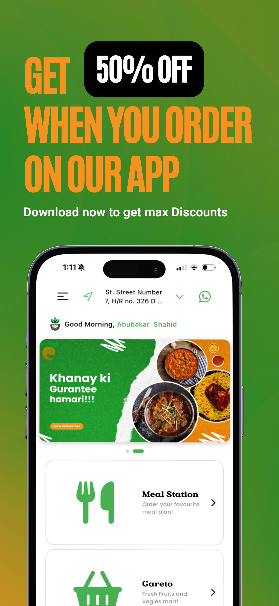 | 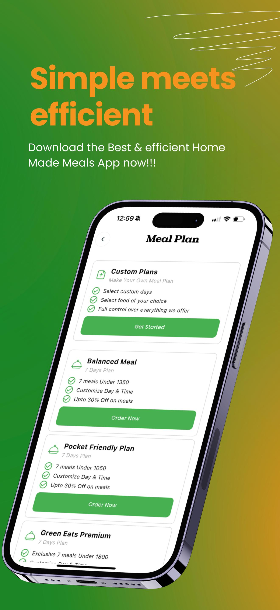 | 
|  | 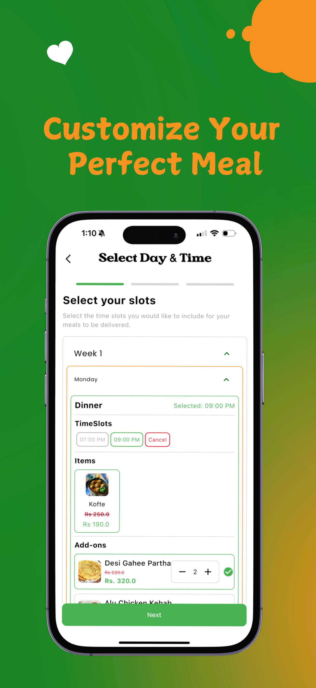 | 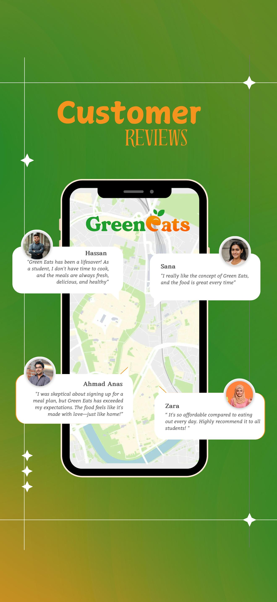 |

<h2 align='center' id="roame">Roame</h2>

Developed 'Roame', a full stack tour planning app with advanced AI features. It connects with multiple social media platforms and allows users to discover trending places. Users can book hotels, restaurants or entire trip packages through the app.

<h3>Tech Stack</h3>
<ul>
  <li><strong>Frontend:</strong> Flutter, Dart, BLoC pattern</li>
  <li><strong>Backend:</strong> Firebase, Cloud Functions, Social Media APIs</li>
  <li><strong>AI Components:</strong> Recommendation engine, Location-based suggestions</li>
  <li><strong>Features:</strong> Social media integration, Maps and navigation, Booking management</li>
</ul>

|                                         |                                         |                                         |
| --------------------------------------- | --------------------------------------- | --------------------------------------- |
|  |  |  |
|  |  |  |

<h2 align='center' id="my-nust">My NUST</h2>

Developed 'My NUST' App (Play Store) for university students using Flutter. Added many smooth animations and other features like in-app web-view, notification reminders, PDF downloading capabilities and encrypted secure local database. It includes tools such as GPA calculation, note-taking, LMS access, hostel dues checking, reminders, and more.

<h3>Tech Stack</h3>
<ul>
  <li><strong>Frontend:</strong> Flutter, Dart, Animation libraries</li>
  <li><strong>Storage:</strong> SQLite, Secure Shared Preferences</li>
  <li><strong>APIs:</strong> University systems integration</li>
  <li><strong>Features:</strong> PDF generation/viewing, Web view integration, Push notifications</li>
</ul>

    
  

 
 
||||
|--------------|--------------|--------------|
| 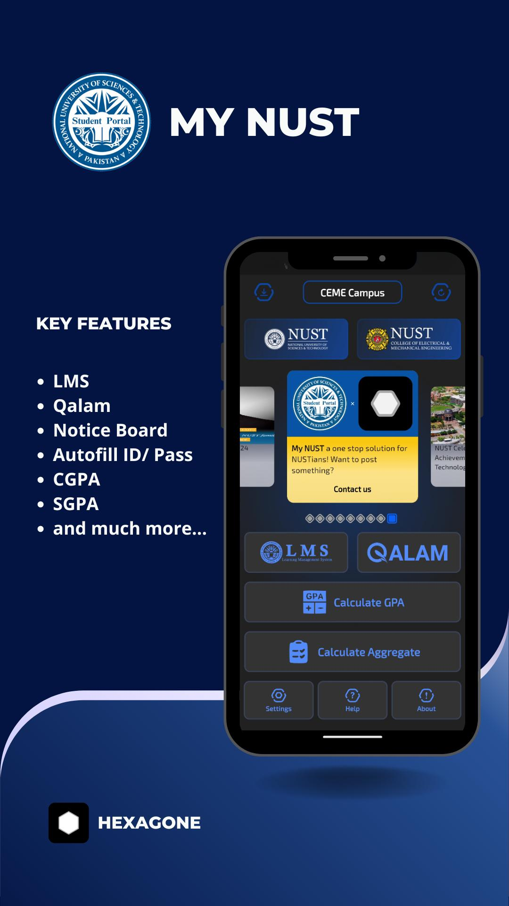 | 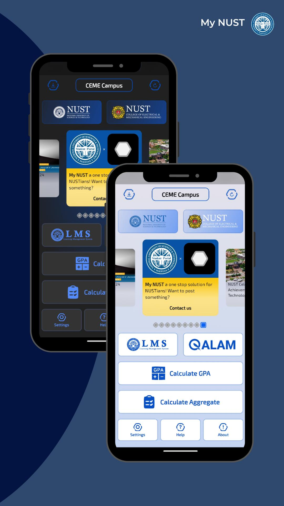 | 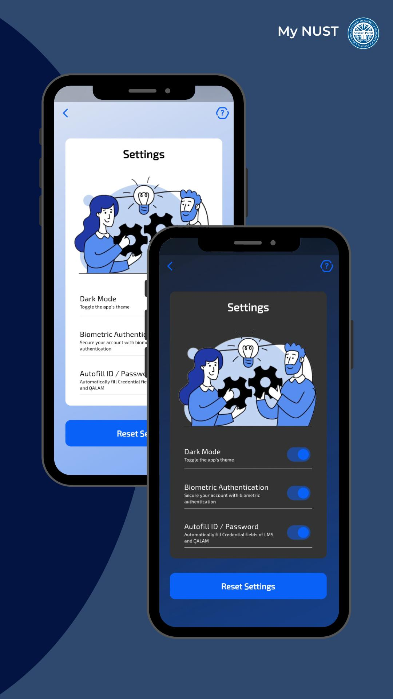 | 
| 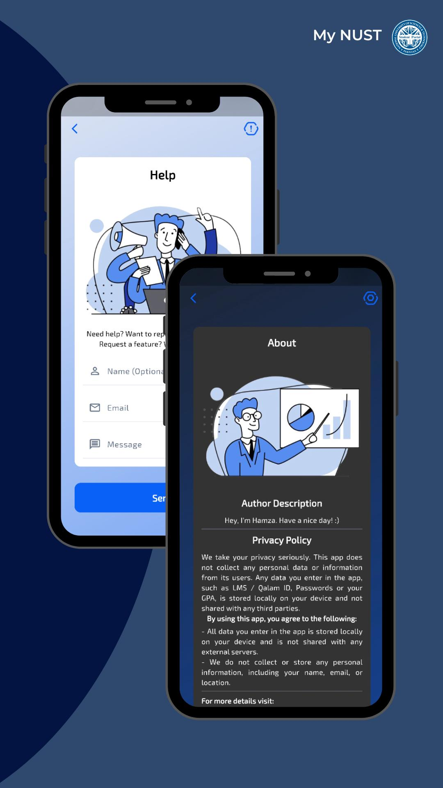 | 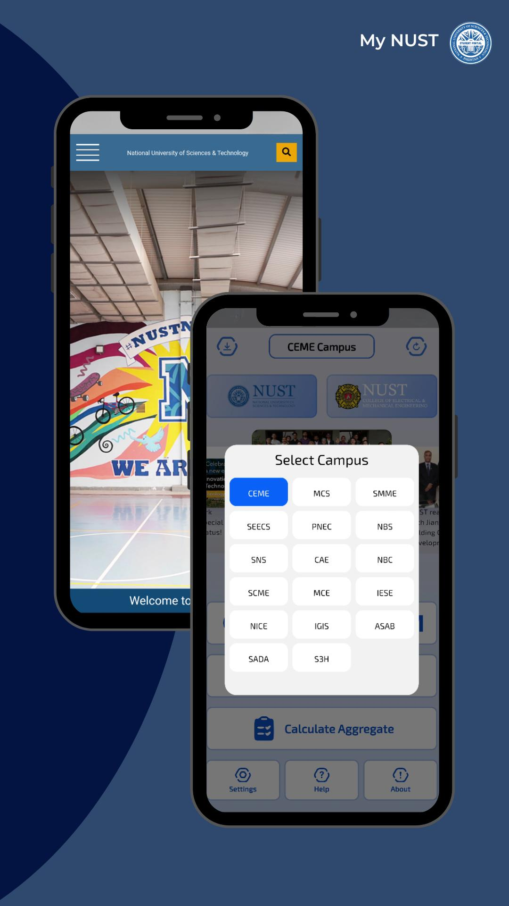 |  |

<h2 align='center' id="wdyt">WDYT</h2>

Developed 'WDYT' App (Play Store & App Store). WDYT – The Emoji Battleground for Opinions is a social app made using Flutter and Firebase. It allows users from across the world to connect and share their opinions through a unique emoji-based interaction system.

<h3>Tech Stack</h3>
<ul>
  <li><strong>Frontend:</strong> Flutter, Dart, GetX state management</li>
  <li><strong>Backend:</strong> Firebase Firestore, Firebase Auth, Cloud Functions</li>
  <li><strong>Features:</strong> Real-time interactions, Social sharing, User profiles, Content moderation</li>
  <li><strong>Platforms:</strong> iOS, Android</li>
</ul>

  
    

 
 
||||
|--------------|--------------|--------------|
|  |  | 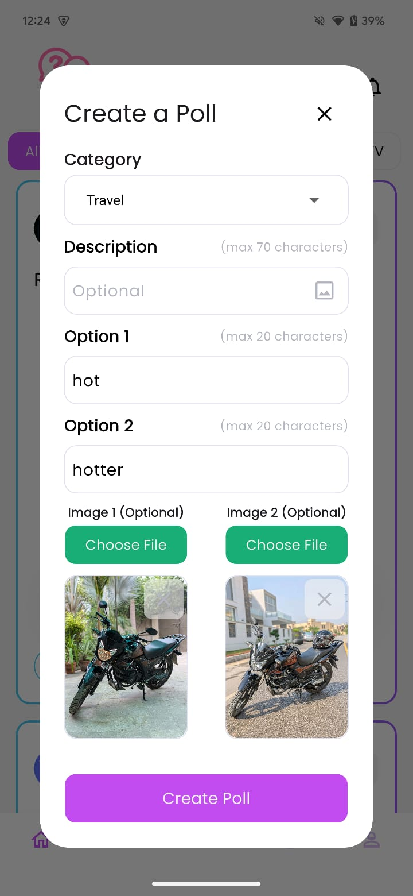 | 
| 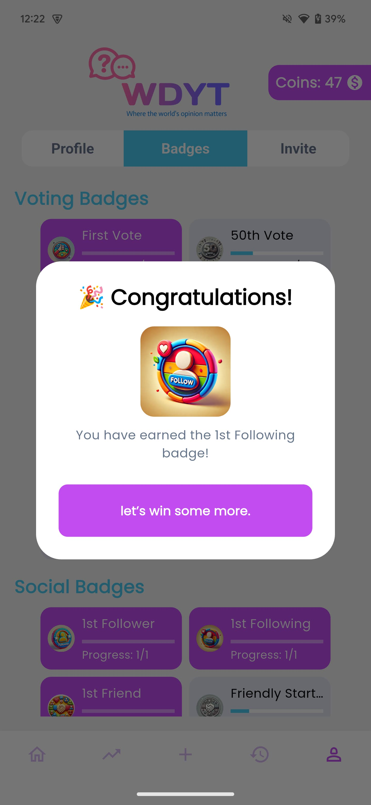 | 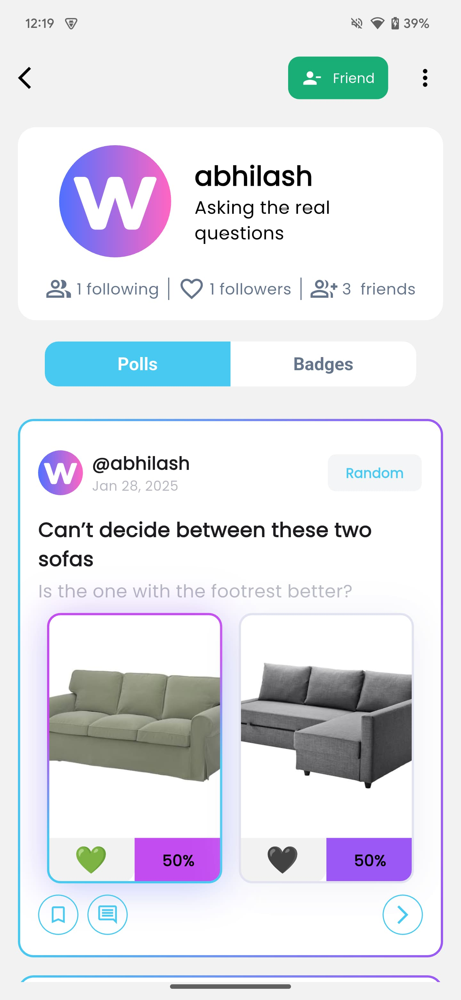 |  |

<h2 align='center' id="mindful-life">Mindful Life</h2>

Developed 'Mindful Life', an AI chatbot app that guides users to live healthier lives. It creates a persona based on user performance and displays progress as a growable tree. Users can select from various AI health specialists to chat about health-related queries.

<h3>Tech Stack</h3>
<ul>
  <li><strong>Frontend:</strong> Flutter, Dart, Riverpod</li>
  <li><strong>AI:</strong> ChatGPT API integration, Custom ML models</li>
  <li><strong>Backend:</strong> Firebase, Cloud Functions</li>
  <li><strong>Features:</strong> Health tracking, AI conversations, Personalized recommendations</li>
</ul>

 

|                                                |                                                |                                                |
| ---------------------------------------------- | ---------------------------------------------- | ---------------------------------------------- |
|  |  |  |
|  |  |  |

<h2 align='center' id="movilar">Movilar</h2>

Developed 'Movilar', a full stack movie app with SQLite for data caching to enable offline support. This app also has a MQTT client-publisher setup through which users can transfer messages to anyone with a common topic.

<h3>Tech Stack</h3>
<ul>
  <li><strong>Frontend:</strong> Flutter, Dart, MobX</li>
  <li><strong>Storage:</strong> SQLite, Hive for local caching</li>
  <li><strong>APIs:</strong> TMDB API, MQTT Protocol</li>
  <li><strong>Features:</strong> Offline first architecture, Real-time messaging, Movie recommendations</li>
</ul>

 

|                                           |                                           |                                           |
| ----------------------------------------- | ----------------------------------------- | ----------------------------------------- |
|  |  |  |
|  |  |  |

<h2 align='center' id="water-flow">Water Flow</h2>

Developed 'Water Flow', a smart water level monitoring app that tracks real-time water levels and flow detected by IoT devices. It maintains monthly water level records and features background geo-fencing that sends notifications when users go out of range, as well as water level alerts when set thresholds are reached. Users can also remotely control water valves through the app.

<h3>Tech Stack</h3>
<ul>
  <li><strong>Frontend:</strong> Flutter, Dart, Provider</li>
  <li><strong>IoT Integration:</strong> MQTT, Arduino/ESP32 communication</li>
  <li><strong>Features:</strong> Geo-fencing, Real-time monitoring, Remote valve control, Historical data analysis</li>
  <li><strong>Backend:</strong> Firebase, Cloud Functions</li>
</ul>

  

 

|                                              |                                              |                                              |
| -------------------------------------------- | -------------------------------------------- | -------------------------------------------- |
|  |  |  |
|  |  |  |

<h2 align='center' id="ybs">Your Bridge School</h2>

Developed 'Your Bridge School', a learning app for YBS students. It contains various levels, units, and audio content that can be added or removed by administrators. The app connects to a Firebase database, and admins have the ability to lock specific units.

<h3>Tech Stack</h3>
<ul>
  <li><strong>Frontend:</strong> Flutter, Dart</li>
  <li><strong>Backend:</strong> Firebase Realtime Database, Firebase Auth</li>
  <li><strong>Features:</strong> Audio playback, User progress tracking, Admin controls</li>
  <li><strong>User Management:</strong> Multi-role system (student/admin)</li>
</ul>

  

 

|                                       |                                       |                                       |
| ------------------------------------- | ------------------------------------- | ------------------------------------- |
|  |  |  |
|  |  |  |

<h2 align='center' id="ez-build">Ez Build</h2>

Developed 'Ez Build', an online marketplace MVP for buying and selling construction materials and services. The app connects contractors, suppliers, and homeowners in a streamlined platform.

<h3>Tech Stack</h3>
<ul>
  <li><strong>Frontend:</strong> Flutter, Dart, Bloc pattern</li>
  <li><strong>Backend:</strong> Firebase, Cloud Firestore</li>
  <li><strong>Features:</strong> Product listings, In-app messaging, Quote requests, Vendor profiles</li>
  <li><strong>Authentication:</strong> Phone number verification, Social login</li>
</ul>

  

|                                            |                                            |                                            |
| ------------------------------------------ | ------------------------------------------ | ------------------------------------------ |
|  |  |  |
|  |  |  |

<h2 align='center' id="battlegrands">Battlegrands</h2>

Developed 'Battlegrands', a competitive gaming tournament app where users can challenge each other or join larger organized tournaments. The platform supports various game types and tournament structures.

<h3>Tech Stack</h3>
<ul>
  <li><strong>Frontend:</strong> Flutter, Dart, GetX</li>
  <li><strong>Backend:</strong> Firebase, Firestore, Real-time Database</li>
  <li><strong>Features:</strong> Tournament brackets, Live scoring, Player profiles, Leaderboards</li>
  <li><strong>Integrations:</strong> Payment gateways, Game API connections</li>
</ul>

 

|                                            |                                            |                                            |
| ------------------------------------------ | ------------------------------------------ | ------------------------------------------ |
| 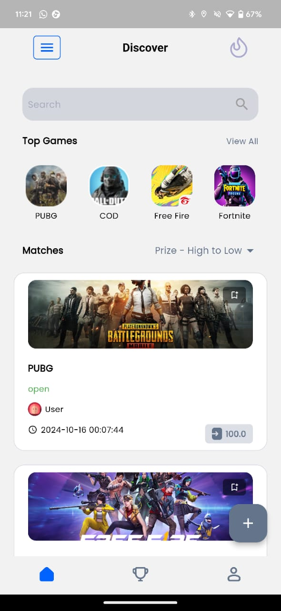 |  | 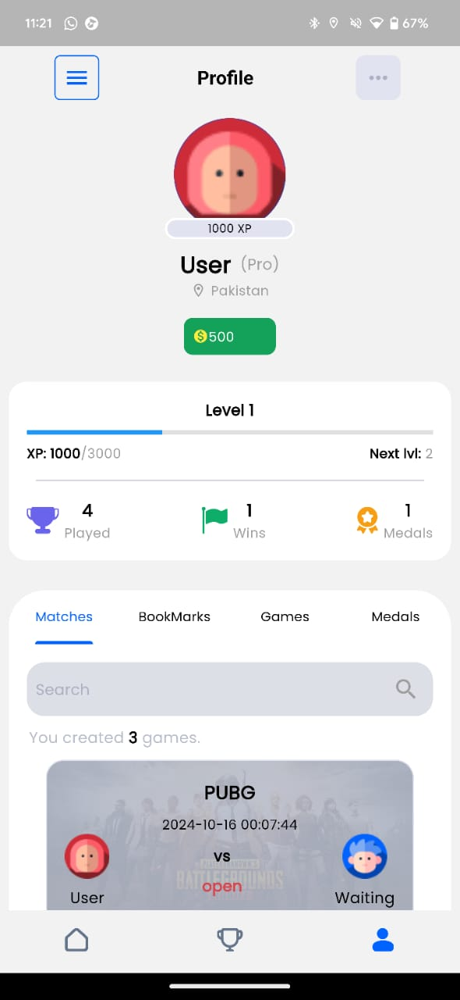 |
|  |  | 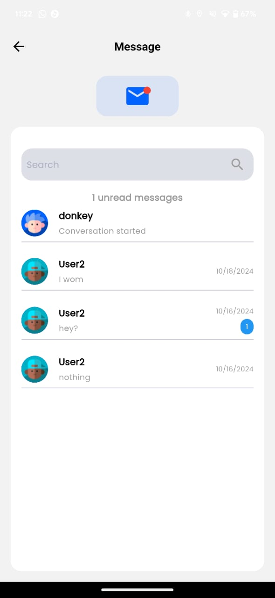 |

<h2 align='center' id="dog-alert">Dog Alert</h2>

Developed 'Dog Alert', an app to track a dog's location and digging status, with functionality to deliver custom training stimuli remotely. This solution helps pet owners monitor and train their dogs effectively.

<h3>Tech Stack</h3>
<ul>
  <li><strong>Frontend:</strong> Flutter, Dart</li>
  <li><strong>Hardware Integration:</strong> Bluetooth LE, IoT device communication</li>
  <li><strong>Location Services:</strong> GPS tracking, Geofencing</li>
  <li><strong>Features:</strong> Real-time location tracking, Behavior monitoring, Remote training</li>
</ul>

|                                         |                                         |                                         |
| --------------------------------------- | --------------------------------------- | --------------------------------------- |
| 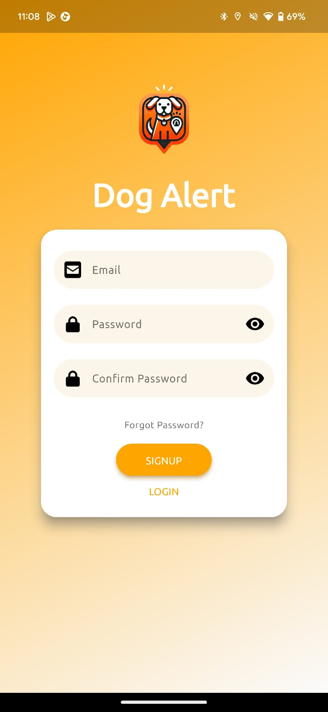 |  |  |
|  |  | 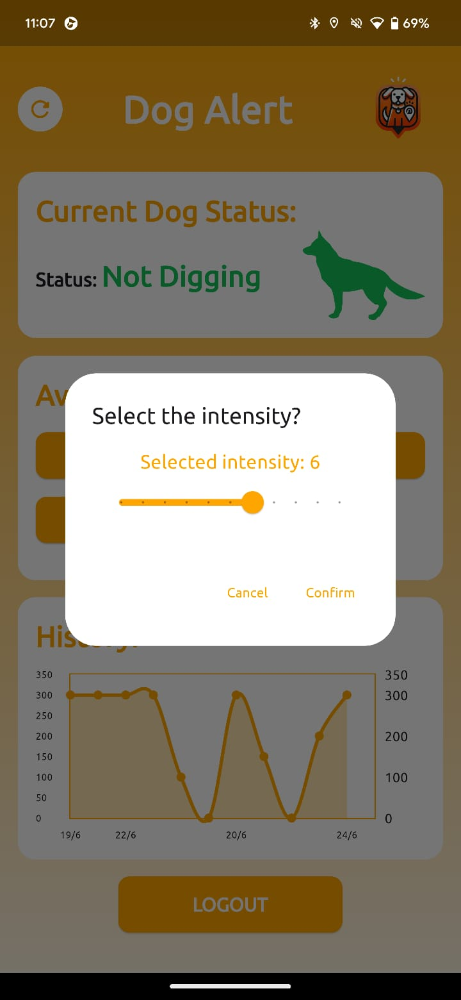 |

<h2 align='center' id="sleep">Sleep</h2>

Developed 'Sleep', a sound therapy application designed to help people with insomnia. The app offers a variety of calming sounds and programs to promote better sleep quality.

<h3>Tech Stack</h3>
<ul>
  <li><strong>Frontend:</strong> Flutter, Dart</li>
  <li><strong>Audio Processing:</strong> Native audio libraries, Background playback</li>
  <li><strong>Features:</strong> Sleep timer, Sound mixing, Preset programs, User profiles</li>
  <li><strong>Data Analysis:</strong> Sleep quality metrics, Usage patterns</li>
</ul>

|                                     |                                     |                                     |
| ----------------------------------- | ----------------------------------- | ----------------------------------- |
|  | 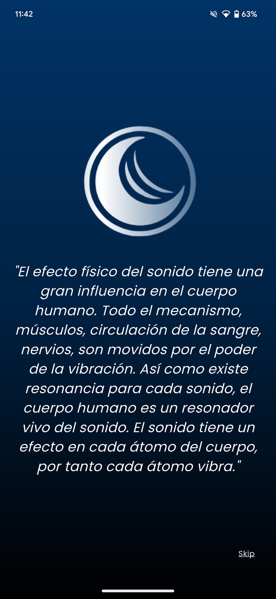 |  |
| 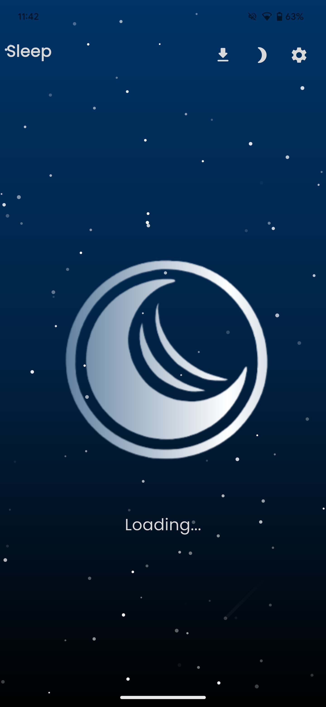 |  |  |

<h2 align='center'>Technical Skills Demonstrated</h2>

Across these projects, I've demonstrated proficiency in:

<ul>
  <li><strong>Languages & Frameworks:</strong> Dart, Flutter, JavaScript, Node.js</li>
  <li><strong>State Management:</strong> Provider, BLoC, GetX, MobX, Riverpod</li>
  <li><strong>Backend Technologies:</strong> Firebase (Auth, Firestore, Functions, Storage), RESTful APIs</li>
  <li><strong>Device Integration:</strong> Camera, GPS, Bluetooth, Push Notifications, Background Services</li>
  <li><strong>UI/UX Design:</strong> Custom animations, Responsive layouts, Platform-specific design patterns</li>
  <li><strong>Architecture Patterns:</strong> MVVM, Repository Pattern, Clean Architecture</li>
  <li><strong>Testing:</strong> Unit testing, Widget testing, Integration testing</li>
  <li><strong>Deployment:</strong> App Store, Google Play Store, Web hosting</li>
</ul>
