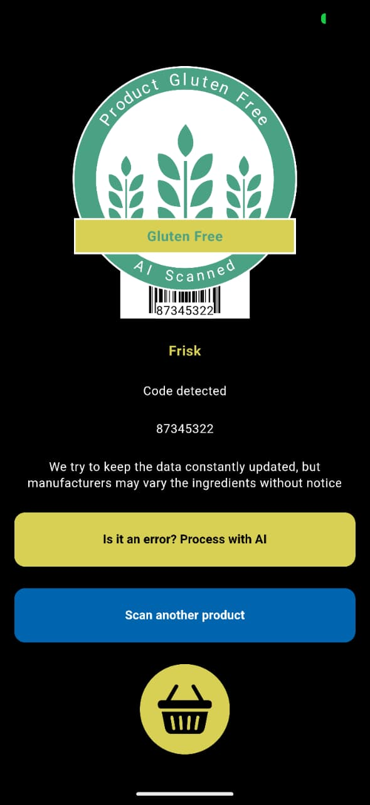
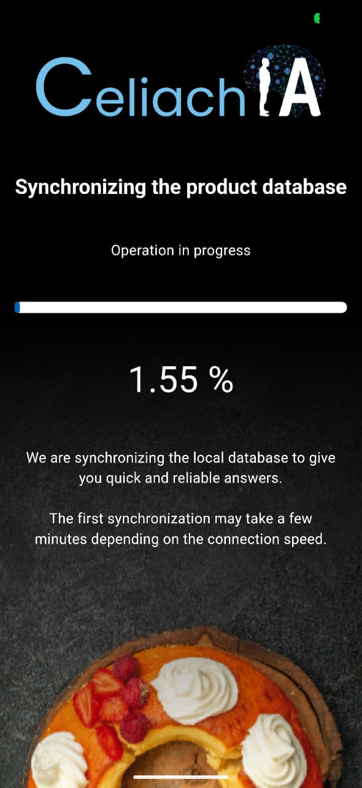
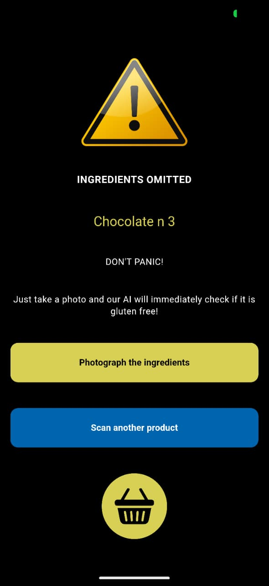
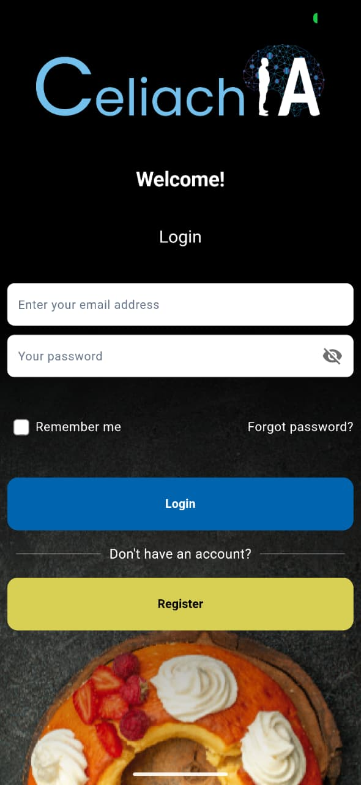
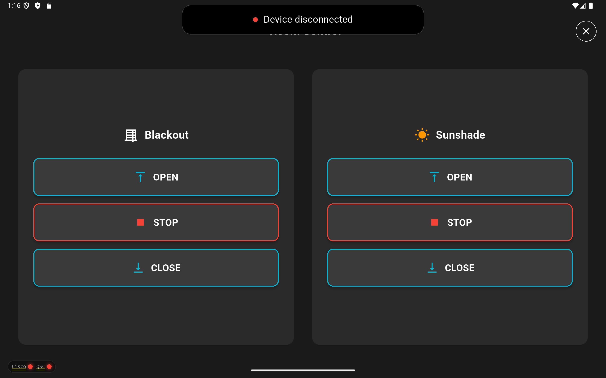
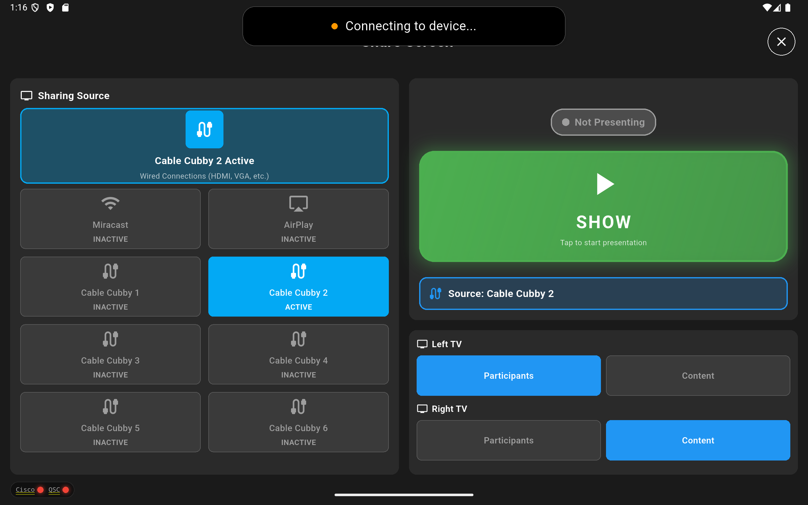

# Hexagone Projects

### About this Repository

This repository contains a collection of projects we have built across industries including e-commerce, fintech, travel, education, healthcare, IoT, and lifestyle.

  

---

## 📋 Contents

| # | Project | Categories |
|:---:|:----------|:------------|
| 1 | [🥗 Green Eats – Grocery App](#-green-eats--grocery-app) | Mobile App, Website |
| 2 | [🔍 Celiach-IA – Gluten Detection App](#-celiach-ia--gluten-detection-app) | Mobile App, AI/ML |
| 3 | [�️ Room-OS – Meeting Room Controller](#-room-os--meeting-room-controller) | Mobile App, IoT |
| 4 | [💧 Water Flow – IoT Water Monitoring](#-water-flow--iot-water-monitoring) | Mobile App, IoT |
| 5 | [🌍 Roame – Tour Planning App](#-roame--tour-planning-app) | Mobile App |
| 6 | [🎓 My NUST – University App](#-my-nust--university-app) | Mobile App |
| 7 | [💸 WatanPay – International Top-Ups](#-watanpay--international-top-ups) | Mobile App |
| 8 | [💬 WDYT – Opinion Sharing App](#-wdyt--opinion-sharing-app) | Mobile App |
| 9 | [🌱 Mindful Life – AI Chatbot App](#-mindful-life--ai-chatbot-app) | Mobile App, AI/ML |
| 10 | [🎬 Movilar – Movie & Messaging App](#-movilar--movie--messaging-app) | Mobile App |
| 11 | [📚 Your Bridge School – Learning App](#-your-bridge-school--learning-app) | Mobile App |
| 12 | [🎮 Battlegrands – Tournaments App](#-battlegrands--tournaments-app) | Mobile App |
| 13 | [🏗 Ez Build – Online Marketplace MVP](#-ez-build--online-marketplace-mvp) | Mobile App |
| 14 | [🐶 Dog Alert – Smart Pet Tracking](#-dog-alert--smart-pet-tracking) | Mobile App, IoT |
| 15 | [🌙 Sleep – Sound Therapy App](#-sleep--sound-therapy-app) | Mobile App |

---

## 🥗 Green Eats – Grocery App

`Mobile App` `Website`

**GreenEats is a comprehensive homemade food delivery application built with Flutter, providing users with healthy meal planning, subscription management, and seamless order tracking.**

The app connects users with homemade food providers offering customizable meal plans tailored to individual preferences and dietary needs, including hostel and office subscription programs.

  
  
  

### Tech Stack

  <code>Flutter 3.2.3+</code>
  <code>GetX</code>
  <code>Firebase Suite</code>
  <code>Cloud Firestore</code>
  <code>Firebase Realtime Database</code>
  <code>PayPro</code>
  <code>Flutter Map</code>

### Features

- **Authentication & User Management**: Email/Password, Google Sign-In, Apple Sign-In with complete profile management, password recovery, and location-based services with geolocation.
- **Advanced Meal Planning System**: Custom Plans (build your own), Planned Plans (pre-designed menus), Fixed Plans (5/7-day weekly menus), Subscription Plans for hostels/offices, multi-meal timeslot support (Breakfast/Lunch/Dinner), combined meal packages with discounts, and calendar-based scheduling.
- **Order Management**: Real-time tracking, order history with status updates, multiple payment options (PayPro integration, wallet payments, direct payment verification), order modifications (time slot changes, cancellations, refund processing).
- **Digital Wallet & Payments**: Built-in wallet system, balance top-up via online payment, transaction history tracking, voucher/discount code support, automatic refund processing, and secure payment gateway integration.
- **Organization Support**: Hostel meal subscriptions, office meal programs, organization-specific pricing, and bulk order management capabilities.
- **Firebase Integration**: Complete Firebase suite including Authentication, Cloud Firestore (users, orders, transactions), Realtime Database (plans, timeslots, organizations), Cloud Messaging (FCM), Analytics, Crashlytics error tracking, and Storage.
- **UI/UX Features**: Dark/Light theme support, responsive design for mobile & web, offline support with connectivity checking, app version update notifications, maintenance mode with feature-specific controls, quick actions, in-app reviews, video content, and social sharing.
- **State Management**: GetX for reactive state management, dependency injection, and navigation with controllers for orders, plans, users, and transactions.

### Screenshots

  
  
  
  
  
  

## 🔍 Celiach-IA – Gluten Detection App

`Mobile App` `AI/ML`

**Celiach-IA is an intelligent mobile app that helps people with celiac disease identify gluten-containing products through barcode scanning and AI-powered ingredient analysis.**

The app combines real-time barcode scanning, OCR-based text recognition, and a comprehensive database of 3+ million products to provide instant, reliable information about food safety.

### Tech Stack

  <code>Flutter</code>
  <code>GetX</code>
  <code>SQLCipher</code>
  <code>Google ML Kit</code>
  <code>Stripe</code>

### Features

- **Barcode Scanner**: Real-time barcode detection with support for multiple formats, offline scanning with encrypted local database, and background processing for pending scans.
- **Ingredient Analysis**: OCR-powered gluten detection in ingredient labels with AI confidence scoring and automatic image blur detection for quality assurance.
- **3M+ Product Database**: Comprehensive SQLCipher-encrypted local database with delta synchronization, stores product information with gluten indicators and supports offline access.
- **User Management**: JWT token-based authentication with automatic refresh, trial mode with 100 free scans, and Stripe-integrated subscription management.
- **Online/Offline Support**: Seamless offline mode with automatic online search when internet is available, background sync for pending operations, and connectivity status monitoring.
- **Security Features**: SQLCipher database encryption, secure JWT token storage with flutter_secure_storage, API key protection, and device ID binding.
- **Advanced Camera Management**: Multiple camera support, flash/torch control, auto-focus with manual override, and sophisticated lifecycle management for iOS/Android.

### Screenshots

  
  
  
  
  
  

## 🎛️ Room-OS – Meeting Room Controller

`Mobile App` `IoT`

**Room-OS is a professional-grade Flutter application for controlling Cisco RoomOS devices across multiple meeting rooms, managing calls, screen sharing, and integrated audio/visual systems.**

Designed for iPad with support for WebEx, Zoom, Microsoft Teams, and QSC-integrated room control systems across multiple floors with real-time device monitoring and secure SSH connectivity.

### Tech Stack

  <code>Flutter</code>
  <code>GetX</code>
  <code>Cisco RoomOS xAPI</code>
  <code>SSH</code>
  <code>QSC</code>
  <code>Firebase</code>

### Features

- **Multi-Variant Room Support**: Manages multiple configured meeting rooms across multiple floors with per-room configuration and secure credential storage.
- **Core Device Control**: Complete volume management, microphone control, camera pan/tilt/zoom, Do Not Disturb mode, and standby management via Cisco RoomOS xAPI integration.
- **Meeting Platform Integration**: Direct integration with WebEx, Zoom, and Microsoft Teams with calendar integration and support for generic meeting URLs.
- **Call Management**: Full incoming/outgoing call handling with visual notifications, call history tracking, phonebook integration, contact sync, and real-time call status monitoring.
- **Advanced Features**: Screen sharing interface, QSC system integration for audio/visual controls, real-time device status monitoring, secure SSH connectivity for advanced commands, and automatic session persistence.
- **Connection Architecture**: Persistent HTTP client with connection pooling, xAPI over HTTPS, SSH2 for device command execution, and automatic reconnection logic with StreamControllers for real-time updates.
- **Standby Mode System**: Real-time monitoring of standby states (Standby, EnteringStandby, Halfwake, Off), black screen overlay with wake-up prompt, and tap-to-wake functionality.
- **Secure Configuration**: Flutter Secure Storage with platform-native encryption, variant-based credential management, and environment-specific device/QSC endpoint configuration.

### Screenshots

  
  
  
  
  
  

## 💧 Water Flow – IoT Water Monitoring

`Mobile App` `IoT`

**Water Flow Monitor is a comprehensive IoT-based water flow monitoring and leak detection system built with Flutter, Firebase, and ESP32, providing real-time monitoring, automated leak detection, and remote valve control.**

The system combines hardware sensors with a mobile application to monitor water usage, detect leaks, and provide automated control over water supply using ESP32 microcontrollers with flow sensors and LoRa communication.

### Tech Stack

  <code>Flutter 3.0+</code>
  <code>GetX</code>
  <code>Firebase RTDB</code>
  <code>Firebase Auth</code>
  <code>FCM</code>
  <code>ESP32</code>
  <code>LoRa 433MHz</code>
  <code>YF-S201 Flow Sensor</code>

### Features

- **Real-Time Monitoring**: Live flow rates (L/s, L/h, L/day), total usage tracking with circular indicators and flow rate cards, historical data with hourly/daily/weekly/monthly analytics, and visual dashboard with interactive charts.
- **Intelligent Alert System**: Automatic leak detection via LoRa sensor network, multiple alert types (leak detection, high flow, valve status, system errors), priority levels with visual differentiation, complete alert history with acknowledgment system, and timestamp tracking.
- **Remote Valve Control**: Automated valve closure on leak detection, manual override via mobile app, real-time valve position monitoring, command queue with reliable delivery via Firebase RTDB, and status synchronization.
- **LoRa Integration**: Long-range 433MHz communication for extended coverage, multiple leak detection points with sensor network, RSSI signal strength monitoring, complete LoRa message history, and ESP32-based gateway.
- **Geofencing & Location**: Location-based enhanced alerts when away from home, configurable radius for geofence boundaries, background location monitoring with 30-second checks, real-time distance calculation from home display.
- **Background Services**: 24/7 persistent monitoring service, periodic alert and geofence checks every 30 seconds, Android 14+ compatible foreground service with notification, auto-start service on app launch, and wake lock for reliability.
- **Data Analytics**: Interactive usage graphs with FL Chart, detailed hour-by-hour breakdown, week-over-week comparison trends, monthly consumption reports, and historical data analysis with automatic rollover.
- **Hardware Setup**: ESP32 with YF-S201 flow sensor (450 pulses/liter), LoRa SX1278 module for communication, 16-pin relay for valve control, WiFi connectivity for Firebase, NTP time synchronization, and calibrated measurement with ±2% accuracy.

### Screenshots

  
  
  
  
  
  

## 🌍 Roame – Tour Planning App

`Mobile App`

**Roame is an AI-powered travel discovery and booking app.**

It connects with social media to highlight trending destinations and allows users to book hotels, restaurants, or complete trips.

### Tech Stack

  <code>PostgreSQL</code>
  <code>Flutter</code>

### Features

- Flutter + Firebase, AI-based recommendations, social media API integration, secure booking system.
- Simplified trip planning, monetization via hotel partnerships, and improved user engagement through social-driven travel discovery.

### Screenshots

  
  
  
  
  
  

## 🎓 My NUST – University App

`Mobile App`

**My NUST is a student-focused utility app for NUST University.**

It combines academic tools and productivity features into one platform.

  

### Tech Stack

  <code>Flutter</code>
  <code>Firebase</code>

### Features

- Flutter app with animations, GPA calculator, LMS integration, reminders, secure local storage, in-app browser, PDF downloads.
- Streamlined academic management, improved student productivity, and reduced manual processes.

### Screenshots

  
  
  
  
  
  

## 💸 WatanPay – International Top-Ups

`Mobile App`

**WatanPay is a secure mobile top-up app for sending balance to families in Afghanistan.**

It emphasizes trust, transparency, and ease of use.

  

### Tech Stack

  <code>Flutter</code>
  <code>Firebase</code>

### Features

- Flutter + Firebase, secure card saving, encrypted payments, real-time exchange rates.
- Enabled diaspora communities to support families instantly, increased trust with transparent rates, built recurring user engagement.

### Screenshots

  
  
  
  
  
  

## 💬 WDYT – Opinion Sharing App

`Mobile App`

**WDYT (What Do You Think?) is a social opinion-sharing platform that gamifies conversations through emoji battles.**

  
  

### Tech Stack

  <code>Flutter</code>
  <code>Firebase</code>

### Features

- Flutter + Firebase, real-time user interactions, Play Store & App Store launch.
- Built global user engagement through gamification, opened monetization via ads/premium packs, and scaled as a cross-platform social tool.

### Screenshots

  
  
  
  
  
  

## 🌱 Mindful Life – AI Chatbot App

`Mobile App` `AI/ML`

**Mindful Life is an AI well-being assistant that guides users toward healthier habits. It uses gamification (growable tree persona) and AI doctors for personalized health advice.**

### Tech Stack

  <code>Flutter</code>
  <code>Node.js</code>

### Features

- Flutter + AI chatbot integration, persona-based gamification, health-focused Q&A.
- Encouraged healthier lifestyles, increased user retention with gamification, potential for integration with digital healthcare.

### Screenshots

  
  
  
  
  
  

## 🎬 Movilar – Movie & Messaging App

`Mobile App`

**Movilar is a movie discovery and messaging platform. It supports offline browsing and real-time communication between users.**

### Tech Stack

  <code>Flutter</code>
  <code>PostgreSQL</code>

### Features

- Flutter + SQLite offline caching, MQTT chat integration, movie API connection.
- Enhanced entertainment experience with offline usability and built-in messaging, paving the way for community-driven engagement.

### Screenshots

  
  
  
  
  
  

## 📚 Your Bridge School – Learning App

`Mobile App`

**Your Bridge School (YBS) is a custom learning app for students. It offers structured lessons, units, and audio-based learning, with admin-controlled content management.**

  
  

### Tech Stack

  <code>Firebase</code>
  <code>Flutter</code>

### Features

- Flutter + Firebase, admin controls for locking/unlocking units, audio-enabled learning modules.
- Improved accessibility for students, empowered admins with flexible content updates, enhanced engagement with multimedia lessons.

### Screenshots

  
  
  
  
  
  

## 🎮 Battlegrands – Tournaments App

`Mobile App`

**Battlegrands is a competitive gaming platform where users can join or host tournaments and challenges.**

### Tech Stack

  <code>Firebase</code>
  <code>Firebase</code>

### Features

- Flutter app with Firebase backend, leaderboard & challenge system.
- Fostered community-driven gaming, opened monetization opportunities through tournament fees and sponsorships.

### Screenshots

  
  
  
  
  
  

## 🏗 Ez Build – Online Marketplace MVP

`Mobile App`

**Ez Build is an MVP for an online buying & selling platform. It enables quick transactions and validates the marketplace model.**

  

### Tech Stack

  <code>Firebase</code>
  <code>Flutter</code>

### Features

- Flutter + Firebase MVP build, lightweight architecture.
- Helped validate business model, created a foundation for scaling into a full-featured marketplace.

### Screenshots

  
  
  
  
  
  

## 🐶 Dog Alert – Smart Pet Tracking

`Mobile App` `IoT`

**Dog Alert is an IoT-based pet safety app that tracks location, detects digging, and allows custom shock control for dogs.**

### Tech Stack

  <code>Firebase</code>
  <code>Firebase</code>
  <code>ESP32</code>

### Features

- Flutter + IoT tracking, real-time location monitoring, smart alerts.
- Improved pet safety, provided peace of mind for owners, showcased innovative IoT use in pet care.

### Screenshots

  
  
  
  
  
  

## 🌙 Sleep – Sound Therapy App

`Mobile App`

**Sleep is a relaxation app that plays therapeutic sounds to help users improve sleep quality and manage insomnia.**

### Tech Stack

  <code>Flutter</code>
  <code>Firebase</code>

### Features

- Flutter app with curated audio library, smooth playback.
- Supported mental well-being, improved sleep quality for users, demonstrated potential in digital therapy solutions.

### Screenshots

  
  
  
  
  
  

---

Last updated: December 03, 2025

