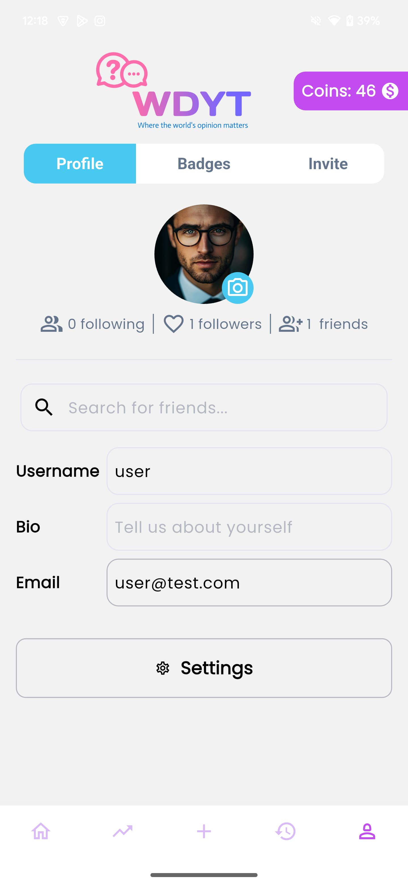

## Flutter projects

<h2 align='center'>About this repository</h2>

  This repository contains a collection of Flutter projects that I have developed. Each project is a standalone application that showcases my skills and expertise in Flutter development.

 
<h2 align='center'>Table of Contents</h2>

<ul>
  <li><a href="#green-eats">Green Eats - Grocery App</a></li>
  <li><a href="#roame">Roame - Tour Planning App</a></li>
  <li><a href="#my-nust">My NUST - University App</a></li>
  <li><a href="#wdyt">WDYT - Opinion Sharing App</a></li>
  <li><a href="#mindful-life">Mindful Life - AI Chatbot App</a></li>
  <li><a href="#movilar">Movilar - Movie App</a></li>
  <li><a href="#water-flow">Water Flow - Water Level Monitoring App</a></li>
  <li><a href="#ybs">Your Bridge School - Learning App</a></li>
  <li><a href="#ez-build">Ez Build - Online Buying and Selling App</a></li>
  <li><a href="#battlegrands">Battlegrands - Tournaments App</a></li>
  <li><a href="#dog-alert">Dog Alert - Dog Tracking App</a></li>
  <li><a href="#sleep">Sleep - Sound Therapy App</a></li>
</ul>

  

<h2 align='center'>Green Eats</h2>

Developed 'Green Eats', a full-stack grocery app with admin panel, available on multiple platforms including Play Store, App Store, and Website. Used Flutter for the front-end and Firebase for database, authentication, hosting, notification service, cloud functions and other cloud features

  
  
  

 
||||
|--------------|--------------|--------------|
|  |  |  | 
|  |  |  |

<h2 align='center'>Roame</h2>

Developed 'Roame', a full stack tour planning app with advance AI features. It connects with multiple social media platforms and let the user view see the trending places on that social media app. User can book a hotel / restaurant or a whole trip.

|                                         |                                         |                                         |
| --------------------------------------- | --------------------------------------- | --------------------------------------- |
|  |  |  |
|  |  |  |

<h2 align='center'>My NUST</h2>

Developed 'My NUST' App (Play Store) for university students using Flutter. Added many smooth animations and other features like in app web-view, notification reminders, download PDF and encrypted secure local database, etc. It includes tools such as GPA calculation, note-taking, LMS access hostel dues checking, add reminders, etc

    
  

 
 
||||
|--------------|--------------|--------------|
|  |  |  | 
|  |  |  |

<h2 align='center'>WDYT</h2>

Developed 'WDYT' App (Play Store & App Store). WDYT – The Emoji Battleground for Opinions is a social app made using flutter and firebase. It allows users from across the the world to connect and share their opinions. 

  
    

 
 
||||
|--------------|--------------|--------------|
|  |  |  | 
|  |  |  |

<h2 align='center'>Mindful Life</h2>

Developed 'Mindful Life', an AI chatbot app that guide its user to live a healthy life. It create a persona based on the performance of the user and display as a growable tree. User can select any of the AI doctor and have chat with him to any health related query.

 

|                                                |                                                |                                                |
| ---------------------------------------------- | ---------------------------------------------- | ---------------------------------------------- |
|  |  |  |
|  |  |  |

<h2 align='center'>Movilar</h2>

Developed 'Movilar', a full stack movie app with SQLite for data caching to enable offline support. This app also has a MQTT client - publisher setup through which user can transfer message to anyone with the common topic.

 

|                                           |                                           |                                           |
| ----------------------------------------- | ----------------------------------------- | ----------------------------------------- |
|  |  |  |
|  |  |  |

<h2 align='center'>Water flow</h2>

Developed 'Water flow', a smart water level monitoring app that can monitor real-time water level and flow, that is detected by an IoT device. It also keep record of water level of the whole month. Other main functionalities include Background Geo-fencing, that will send notification to user when he/she is out of range and water level alert when reminder is set to particular level. User can also turn on and off the water valve using the app.

  

 

|                                              |                                              |                                              |
| -------------------------------------------- | -------------------------------------------- | -------------------------------------------- |
|  |  |  |
|  |  |  |

<h2 align='center'>Your Bridge School</h2>

Developed 'Your Bridge School', a learning app for students of YBS. It contains many levels, units and audios which can be added or removed by the admin and can. The app is connected to the firebase database. Admin can also lock a unit.

  

 

|                                       |                                       |                                       |
| ------------------------------------- | ------------------------------------- | ------------------------------------- |
|  |  |  |
|  |  |  |

<h2 align='center'>Ez Build</h2>

Developed 'Ez Build', an online buying and selling app MVP.

  

|                                            |                                            |                                            |
| ------------------------------------------ | ------------------------------------------ | ------------------------------------------ |
|  |  |  |
|  |  |  |

<h2 align='center'>Battlegrands</h2>

Developed 'Battlegrands', a tournaments app, where users can challenge each other or join large tournaments.

<!-- 

  

 -->
 

|                                            |                                            |                                            |
| ------------------------------------------ | ------------------------------------------ | ------------------------------------------ |
|  |  |  |
|  |  |  |

<h2 align='center'>Dog Alert</h2>

Developed 'Dog Alert', app to track dog's location and digging status along with giving custom shocks to a dog.

<!-- 

  

 -->

|                                         |                                         |                                         |
| --------------------------------------- | --------------------------------------- | --------------------------------------- |
|  |  |  |
|  |  |  |

<h2 align='center'>Sleep</h2>

Developed 'Sleep', an app to play sounds to help people with with insomnia.

<!-- 

  

 -->

|                                     |                                     |                                     |
| ----------------------------------- | ----------------------------------- | ----------------------------------- |
|  |  |  |
|  |  |  |
